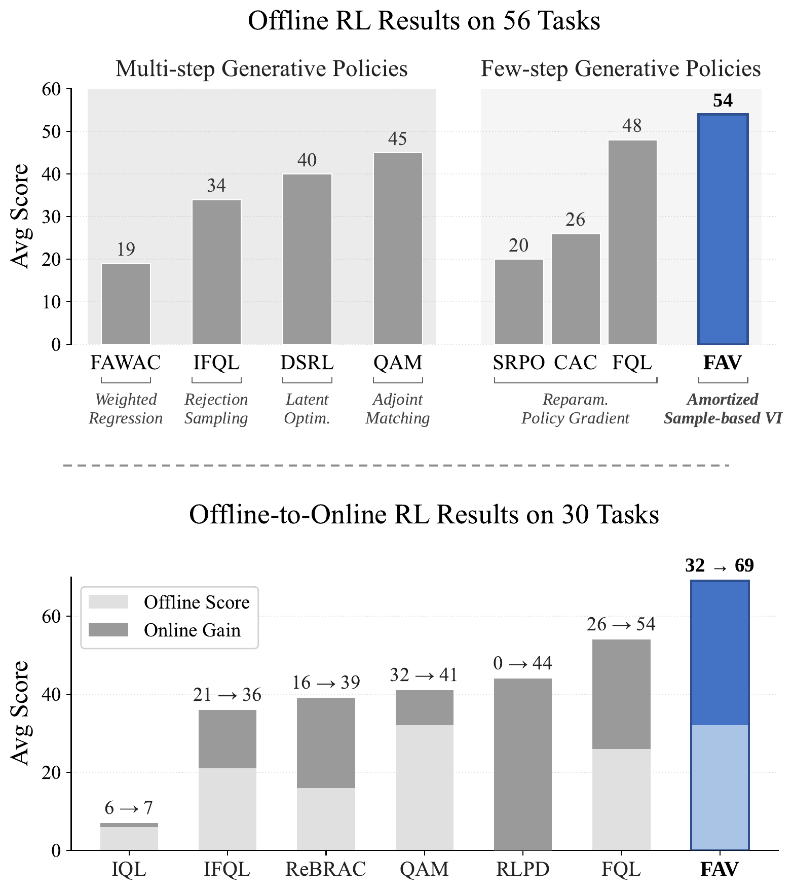
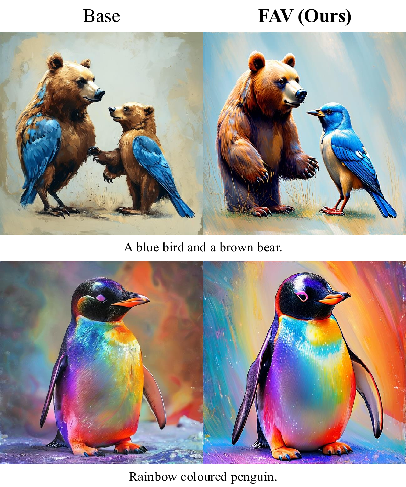

# Aligning Few-Step Generative Models by Amortizing Sample-based Variational Inference
Jaewoo Lee\*<sup>1,2</sup>, Hyeongyu Kang\*<sup>1</sup>, Dohyun Kim<sup>1</sup>, Kyuil Sim<sup>1</sup>, Woocheol Shin<sup>1</sup>, Minsu Kim<sup>1,3</sup>, Taeyoung Yun<sup>1</sup>, Jeongjae Lee<sup>1</sup>, Sanghyeok Choi<sup>4</sup>, Tabitha Edith Lee<sup>3,5</sup>, Jong Chul Ye†<sup>1</sup>, Jinkyoo Park†<sup>1,6</sup>

<sup>1</sup>KAIST &nbsp; <sup>2</sup>MongooseAI &nbsp; <sup>3</sup>Mila – Quebec AI Institute &nbsp; <sup>4</sup>University of Edinburgh &nbsp; <sup>5</sup>Université de Montréal &nbsp; <sup>6</sup>Omelet

<sub>\* Equal contribution &nbsp;&nbsp; † Corresponding author</sub>

<p align="center">
  <a href="https://arxiv.org/abs/2605.26552"></a>
  <a href="https://jaewoopudding.github.io/fav_project_page"></a>
</p>

<p align="center">
  
  
</p>


## Abstract
Aligning a few-step generative model is challenging, since existing alignment
frameworks typically rely on restrictive assumptions: a tractable likelihood,
a specific ODE/SDE solver, or a particular model family. We introduce **FAV**
(*Few-step Generative Models Alignment via Sample-based Variational Inference*),
a general alignment framework that requires only sample access to the generator
and the reference distribution. We cast alignment as sampling from a
reward-tilted distribution anchored to a reference distribution. We leverage
Stein Variational Gradient Descent as a sample-based variational inference
scheme and amortize its particle updates into the generator parameters via
fixed-point regression. We evaluate FAV on two domains: robotics manipulation
and image generator alignment. On generative policy alignment for robotic
manipulation, FAV outperforms prevailing policy extraction baselines across 56
offline and 30 offline-to-online RL tasks. For image generator alignment, FAV
fine-tunes diverse few-step backbones, including GAN, drifting model,
consistency models, and flow maps, scaling from ImageNet-256 to 1024²
text-to-image synthesis.


## Tasks

| Task  | Directory |
|------|-----------|
| **Reinforcement Learning** (offline & offline-to-online) | [`fav-offrl/`](fav-offrl/) |
| **2D Toy Setting**  | [`fav-toy/`](fav-toy/) |
| **Conditional Image Generation** | [`fav-conditional-image/`](fav-conditional-image/) |
| **Text-to-Image** | [`fav-text-to-image/`](fav-text-to-image/) |


## Citation

If you find this repository helpful, please cite our work:

```bibtex
@article{lee2026aligning,
  title={Aligning Few-Step Generative Models by Amortizing Sample-based Variational Inference},
  author={Lee, Jaewoo and Kang, Hyeongyu and Kim, Dohyun and Sim, Kyuil and Shin, Woocheol and Kim, Minsu and Yun, Taeyoung and Lee, Jeongjae and Choi, Sanghyeok and Lee, Tabitha Edith and Ye, Jong Chul and Park, Jinkyoo},
  journal={arXiv preprint arXiv:2605.26552},
  year={2026}
}
```
