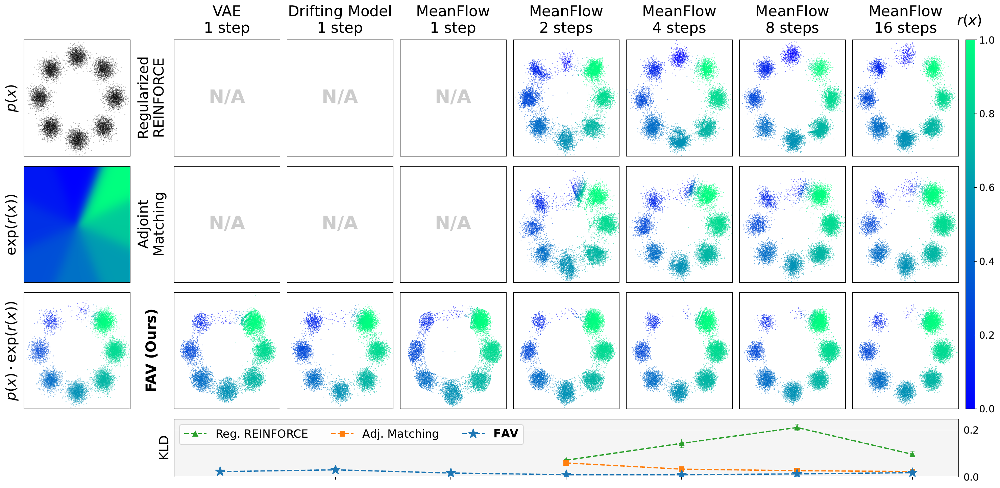

<div align="center">

<h1>FAV for 2D toy Setting</h1>



</div>

## Overview

This repository contains the 2D toy experiments for **FAV**, a single step
generative policy that samples from the energy tilted distribution
`p(x) · exp(r(x))` by amortizing SVGD particle updates into the generator
via fixed point regression. The toy setting visualizes FAV's mechanism on
the 8gaussians benchmark across three generator families: a one step
**drift** model, **MeanFlow** with configurable ODE steps, and a one step
**VAE**, and benchmarks against Regularized REINFORCE (RTB) and Adjoint
Matching.

## Installation

```bash
conda create -n fav_toy python=3.10
conda activate fav_toy
pip install torch numpy pandas pyyaml tqdm scipy scikit-learn
```

## Usage

### Pretrain a base generator

```bash
python pretrain.py --model drift
python pretrain.py --model meanflow
python pretrain.py --model vae
```

The checkpoint is saved to `checkpoints/{model}/8gaussians/model_pretrained.pt`.

### FAV fine tuning

```bash
python finetune.py --model drift    --algo fav
python finetune.py --model vae      --algo fav
python finetune.py --model meanflow --algo fav --steps 1 2 4 8 16
```

`--steps N` is MeanFlow only; FAV trains a separate generator per ODE step
count. `--temp` controls the SVGD RBF kernel bandwidth (default `0.05`); the
KDE prior pool is always sampled from the frozen pretrained model.

### Baselines

```bash
# Adjoint Matching (MeanFlow only)
python finetune.py --model meanflow --algo adjoint_matching --steps 2 4 8 16

# Regularized REINFORCE / RTB (MeanFlow only)
python finetune.py --model meanflow --algo reg_reinforce --steps 2  --noise_level 0.01
python finetune.py --model meanflow --algo reg_reinforce --steps 4  --noise_level 0.05
python finetune.py --model meanflow --algo reg_reinforce --steps 8  --noise_level 0.10
python finetune.py --model meanflow --algo reg_reinforce --steps 16 --noise_level 0.20
```

## Acknowledgments

The 8gaussians dataset and energy function are adapted from
[CEP-energy-guided-diffusion](https://github.com/ChenDRAG/CEP-energy-guided-diffusion).
